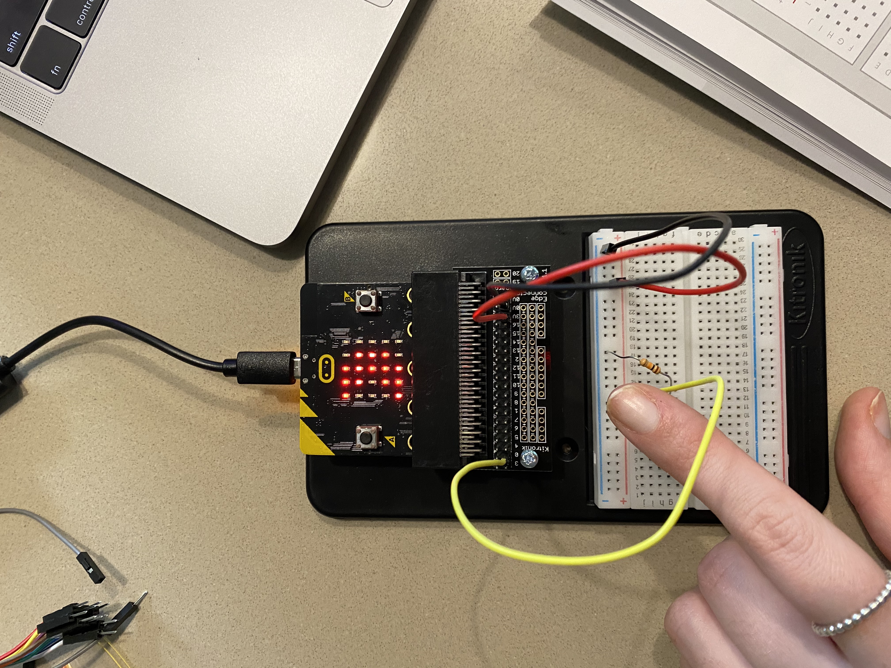
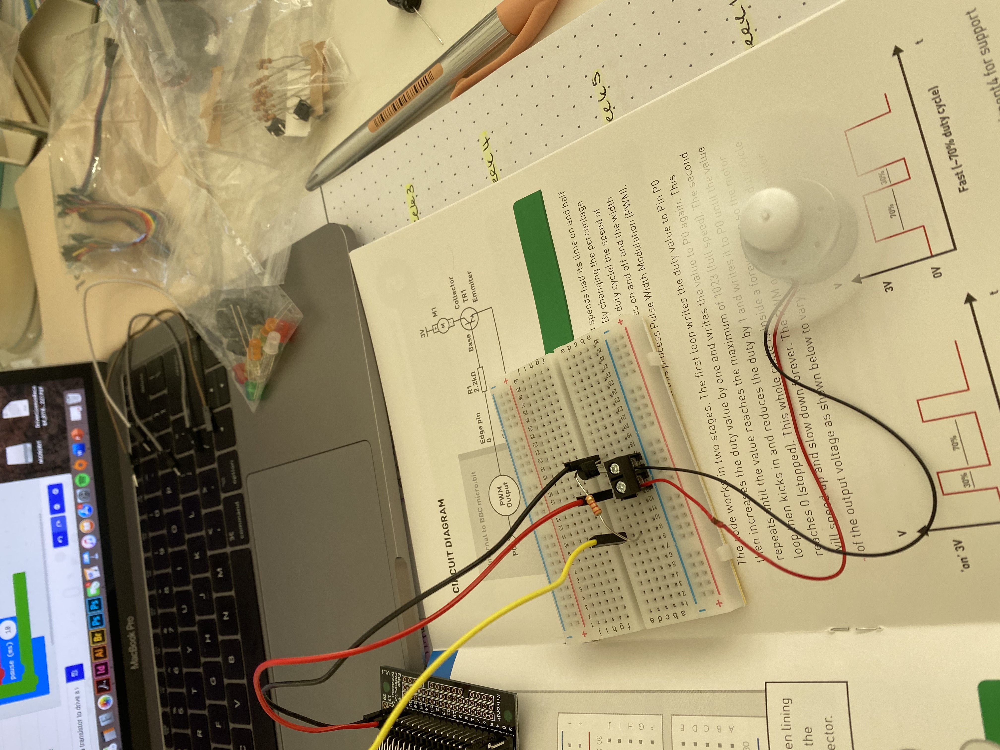
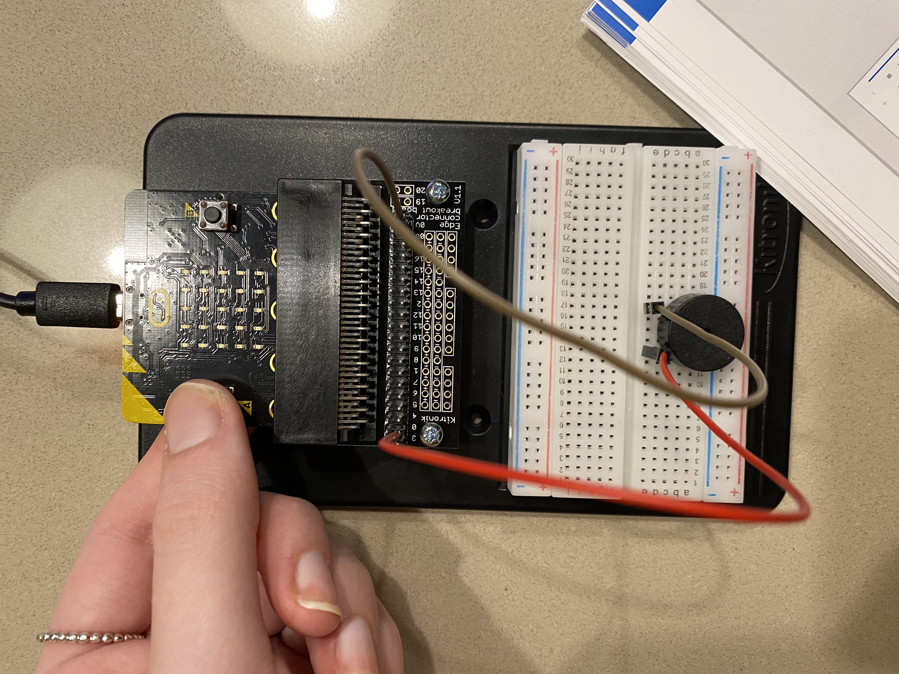

# Inventor Kit Experiments

*Markdown reference: https://guides.github.com/features/mastering-markdown/*

## Instructions ##

*For a selection of 5 inventor kit experiments that you choose, fill out the following sections.

### Saying 'Hello!' to the BBC micro:bit ###

#### Photo of completed project ####
*In the code below, replace `missingimage.png` with the name of the image, which should be in the `kitexperiments` folder.*

(Insert a caption here)

#### Reflection ####

In this experiment, I learnt the basics of using a mirco:bit and bread board to display icons and words. 

This experiment could be the basis of a real world application such as (insert something here).

### Using a light sensor and analog inputs ###

#### Photo of completed project ####
In the code below, replace imagemissing.jpg with the name of the image, which should be in the kitexperiments folder.

(Insert a caption here)

#### Reflection ####

In this experiment, I've learnt how to use a light sensor, while also being able to change the lighting when the enviroment is lighter or darker.

This experiment could be the basis of a real world application such as (insert someth.

### Dimming an LED using a potentiometer ###

(Replace this with the experiment name)

#### Photo of completed project ####
In the code below, replace imagemissing.jpg with the name of the image, which should be in the kitexperiments folder.

(Insert a caption here)

#### Reflection ####

In this experiment, I've learnt how to not only make light but also how to dim the lighting when needed.

This experiment could be the basis of a real world application such as a typical light switch in your house.

### Using transistor to drive a motor ###

(Replace this with the experiment name)

#### Photo of completed project ####
In the code below, replace imagemissing.jpg with the name of the image, which should be in the kitexperiments folder.

(Insert a caption here)

#### Reflection ####

In this experiment, I've learnt the ability to create a moving and functional fan.

This experiment could be the basis of a real world application such as a fan for an bedroom, office space etc.

### Setting the tone with piezo buzzer ###

(Replace this with the experiment name)

#### Photo of completed project ####
In the code below, replace imagemissing.jpg with the name of the image, which should be in the kitexperiments folder.

(Insert a caption here)

#### Reflection ####

In this experiment, I've learnt how to use a piezo buzzer.

This experiment could be the basis of a real world application such as (insert something here).

