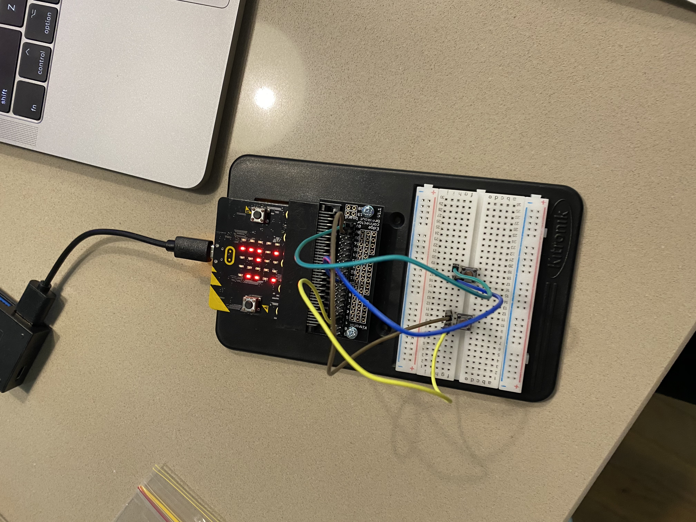

# Inventor Kit Experiments

*Markdown reference: https://guides.github.com/features/mastering-markdown/*

## Instructions ##

*For a selection of 5 inventor kit experiments that you choose, fill out the following sections.

### Saying 'Hello!' to the BBC micro:bit ###

#### Photo of completed project ####

Figure 1.1 showing the 'H' of the continuous 'Hello' sign. 

#### Reflection ####

In this experiment, I learnt the basics of using a mirco:bit and bread board to display icons and words. 

This experiment could be the basis of a real world application such as (insert something here).

### Using a light sensor and analog inputs ###

#### Photo of completed project ####

Figure 1.2 showing myself covering the light to display the moon, because it's dark.

#### Reflection ####

In this experiment, I've learnt how to use a light sensor, while also being able to change the lighting when the enviroment is lighter or darker.

This experiment could be the basis of a real world application such as (insert someth.

### Dimming an LED using a potentiometer ###

#### Photo of completed project ####

Figure 1.3 showing myself turning the dimmer all the way to make it light. 

#### Reflection ####

In this experiment, I've learnt how to not only make light but also how to dim the lighting when needed.

This experiment could be the basis of a real world application such as a typical light switch in your house.

### Using transistor to drive a motor ###

#### Photo of completed project ####

Figure 1.4 showing the motor driving the mini fan.

#### Reflection ####

In this experiment, I've learnt the ability to create a moving and functional fan.

This experiment could be the basis of a real world application such as a fan for an bedroom, office space etc.

### Setting the tone with piezo buzzer ###

#### Photo of completed project ####

Figure 1.5 showing myself pressing the A button on the mircobit, whilst the buzzer goes off.

#### Reflection ####

In this experiment, I've learnt how to use a piezo buzzer.

This experiment could be the basis of a real world application such as (insert something here).

