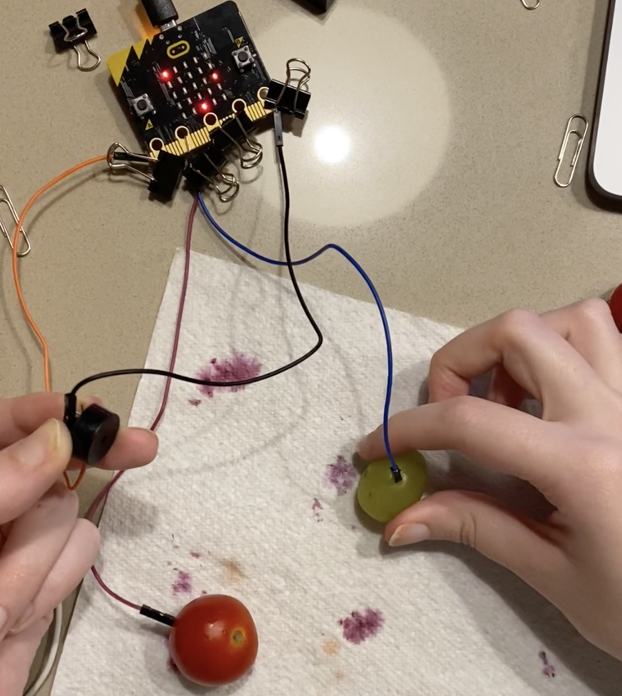

# Assessment 1: Replication project

*Fill out the following workbook with information relevant to your project.*

*Markdown reference:* [https://guides.github.com/features/mastering-markdown/](http://guides.github.com/features/mastering-markdown/)

## Banana Keyboard ##

## Related projects ##

### Project 1 - Piezo Buzzer with BBC micro:bit ###

https://www.hackster.io/anish78/piezo-buzzer-with-bbc-micro-bit-b0fc27

This project is related to mine because this will be the starting point for my experiment, this will be the absolute basics of how to create my project.

### Project 2 - Don't Steal my BBC micro:bit Alarm ###

https://www.kitronik.co.uk/blog/microbit-alarm-kitronik-university/

This project is related to mine because (insert reasons here).

### Project 3 - Hitting the Right Note with The :KLEF Piano ###

https://www.cieonline.co.uk/kitronik-hits-the-high-note-with-the-launch-of-three-new-bbc-microbit-products/

This project is related to mine because (insert reasons here).

### Project 4 - Radio project ###

https://makecode.microbit.org/courses/csintro/radio/project

This project is related to mine because (insert reasons here).

### Project 5 - Analog keyboard ###

https://www.elephantjay.com/blogs/tutorial/234

This project is related to mine because (insert reasons here).

### Project 6 - Fruit Piano ###

https://category.yahboom.net/products/alligatorclipboard

This project is related to mine because (insert reasons here).

## Reading reflections ##
*Reflective reading is an important part of actually making your reading worthwhile. Don't just read the words to understand what they say: read to see how the ideas in the text fit with and potentially change your existing knowledge and maybe even conceptual frameworks. We assume you can basically figure out what the readings mean, but the more important process is to understand how that changes what you think, particularly in the context of your project.*

*For each of the assigned readings, answer the questions below.*

### Reading: Don Norman, The Design of Everyday Things, Chapter 1 (The Psychopathology of Everyday Things) ###

Before reading 'The Design of Everyday Things', I believed that an affordance and signifier was the same thing. Whilst reading, I've figured out the difference between the both of them.

I learn't the definitions of both an affordance and signifier. An affordance determines what actions are possible, whereas signifiers communicate where the action should take place.

I would like to learn more about all the different kinds of affordance and signifiers there are and how they work together. 

Reading about affordances and signifiers will help with my contruction of my banana project. By knowing the difference between the two, now I can incorporate that knowlegde into my project.

### Reading: Chapter 1 of Dan Saffer, Microinteractions: Designing with Details, Chapter 1 ###

I had no idea what a Mircointeraction was before reading this chapter. But with the knowledge of understanding, it's easy to pick out what a Mircoininteration really is. 

I've learn't the definition of a Mircointeraction, and how they differ from featues in both their sizes and scope. They are simple, brief and an effortless design technique. I've also learn't what they are good for and where they are needed. 

I found it interesting learning about the structure of Mircointeractions and the different triggers and rules. I'd like to see more exaples of this being used on everyday devices.

This is releavnt to the project I'm working because Mircointeration is used to better user interaction and experience. This is important for my banana project to try an include a Mircointeration to make it easier for the user to use. 

### Reading: Scott Sullivan, Prototyping Interactive Objects ###

I thought before reading into this, that the process of design was plain and simple. Once going in and having a read, I've noticed that it can become a lot more complex. 

I've learnt the process it takes to complete an interactive object and that prototyping is very important for the whole design to work. Their are many challeneges you'll need to overcome when creating a project, and trial and error is key!

I would like to learn/read more examples of people's projects and how their process differs from  Sullivan's project. 

Learning the process is useful for my developing design, being able to overcome obsticals and use trial and error. 

## Interaction flowchart ##

## Process documentation

*In this section, include text and images that represent the development of your project including sources you've found (URLs and written references), choices you've made, sketches you've done, iterations completed, materials you've investigated, and code samples. Use the markdown reference for help in formatting the material.*

*This should have quite a lot of information!*

*There will likely by a dozen or so images of the project under construction. The images should help explain why you've made the choices you've made as well as what you have done. Use the code below to include images, and copy it for each image, updating the information for each.*

## Part 1 ##

(Insert Comment)

## Part 2 ##

(Insert Comment)

## Part 3 ##

(Insert Comment)

## Part 4 ##

(Insert Comment)

## Part 5 ##

(Insert Comment)

## Project outcome ##

### Potato Buzzer ###

### Project description ###

This project I've created is called the 'Potato Buzzer'. The potato buzzer is used for people needing a quick and easy buzzer for family game nights. The buzzer was created to be quick and simple for anyone to be able to me. 

### Showcase image ###

### Additional view ###

### Reflection ###

My whole journey through this experiment was very challenging because of my lack of knowledge on the topic. I struggled to even get the basics of this experiment working, which made it hard for me to add to. This is the reason for my ‘Potato Buzzer’ project. It was never going to be called this, but over my journey it was the only thing that made sense to me. I spent days trying to trial and error to help me with my process, but in the end, I made something extremely useful for anyone who’s playing a game needed a buzzer. I changed the original experiment by using a piezo element buzzer instead of headphones. I also replaced the banana’s with potatoes. My reasoning behind this was that I wanted to use an object that was round, something that was easily accessible for anyone, usually you’d have a potato rolling around in your fridge. The great thing about this experiment is the capability of using any kind of object you can think of, therefore this element can easily fit the user’s needs. 
This experiment could be improved by adding several different objects to create as a buzzer. Therefore, when playing a game, you can use just one mircobit, instead of having to create several different versions of the buzzer. Also perhaps making a button instead of using objects, this might improve the buzzer due to it being already there, without having to source your own button. 
From the research I gathered, project 5 was really interesting to me. Perhaps something like this could be an extension off of my project. Connecting up my project to a digital display would elevate the whole project. Using the buzzer to either create different keyboard notes and play songs or use the buzzers in particular online games. There is no limit for what this project could create if it went further. 
Overall the outcome wasn’t what I wanted because of my lack in skills and technique. The project was very challenging for me, yet I’m still happy with the outcome because it’s a functional and useful project to create. 

